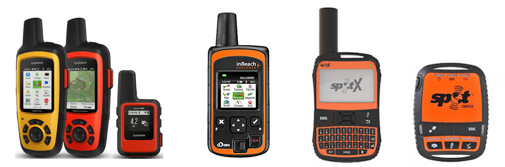

# TrackPilots API

# Description
TrackPilots API allows you to easily access multiple Pilots tracking data regardless of which satellite tracker they have, in one easy to use standardized format. All it needs is your name and tracking link. Pilots can create and join groups so that they can be tracked together using one API call, again regardless of which tracking device they use.

# Supported Devices

  - [Garmin Inreach Satellite Trackers](https://explore.garmin.com/en-US/inreach/)
  - [Delorme Inreach Satellite Trackers](https://www.amazon.com/DeLorme-inReach-SE-Satellite-Tracker/dp/B00BX7TJ2O)
  - [SPOT Satellite Trackers](https://www.findmespot.com/en/)
  - iOS & Android (with cell reception) 

# Un-Supported Devices (Coming Soon)
 - [FlyMaster Flight Instruments](https://www.flymaster.net/)
 - [Yellow Brick Satellite Trackers](https://www.ybtracking.com/)
 - [FLARM](https://flarm.com/)
 - OGN/ICA

# App Structure
  

# TODO
 - Configure Terraform to deploy AWS MySQL DB and send session endpoint to the lambda function
 - Connect lambda function to CloudWatch logs via Terraform
 - Fix lambda function cold start issue that returns (500 Internal Server Error) when getting group tracking data for the first time.
 - Add serverside validation for the creation of users, groups, pings, etc.
 - Refactor the service functions that retrieve and save tracking data. Combine all DB insert queries into one large query to save time and money.
 - Figure out how and when to calculate a pilot's altitude AGL.
 - Create a handler and service function that creates all database tables without having to log directly into the DB from MySQL workbench.
 - Create short youtube tutorials for each tracker type explaining how to set up and get the correct tracking link.